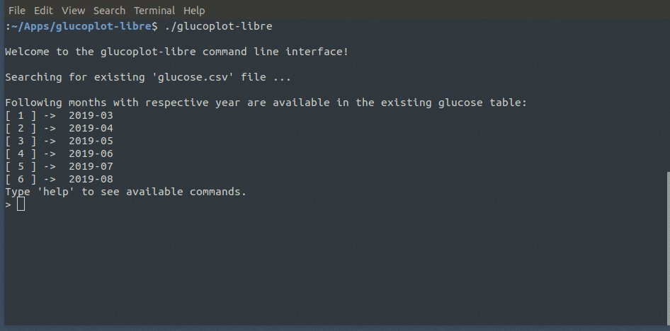

# glucoplot-libre
Linux-based PDF report generator for FreeStyle Libre GCM device.

This project provides a linux-compatible command line interface program developed with Python libraries (requirements.txt) and capable of generating PDF reports with glucose data dumped from the FreeStyle Libre CGM system.

## 1 - How to use:

1 - After cloning the repository, create and enable a virtual enviroment with 'venv' in a separate folder:
```
$ mkdir dev_folder
$ python3 -m venv /dev_folder
$ cd dev_folder
$ source bin/activate
```
2 - Copy '/src' folder and its contents from the repository to the '/dev_folder'.

3 - Install all libraries provided by the 'requirements.txt' file with:
```
$ pip install -r requirements.txt
```
4 - Make sure you have 'pyinstaller' installed globally. To build the program, run pyinstaller as:
```
$ pyinstaller -F glucoplot-libre.py
```
5 - After building the program, copy 'patient_data.txt' to '/dist' folder. Change the executable permissions and run it:
```
$ cd dist
$ sudo chmod 666 glucoplot-libre
$ ./glucoplot-libre
```

### 2 - Commands:

After starting the program, following commands are available:

- **check** 

Check existing months with associated year in the glucose.csv file.

Usage: ```> check```

- **get**

Check if reader is connected. If positive, send request to dump data on .csv file.

Usage: ```> get```

- **help**

Provides general and specific command documentation.

Usage: ```> help``` or ```> help <command>``` 

- **process**

Parse, plot and print daily glucose curves in a PDF file for desired month.

Usage: ```> process <month_index>```

<month_index> = integer representing a valid month found in the glucose table.

- **quit**

Quits the program.

Usage: ```> quit```

### 3 - Example usage:



### 4 - Example output:


